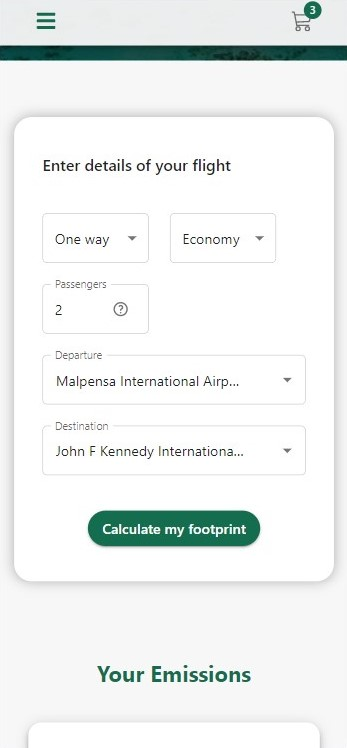
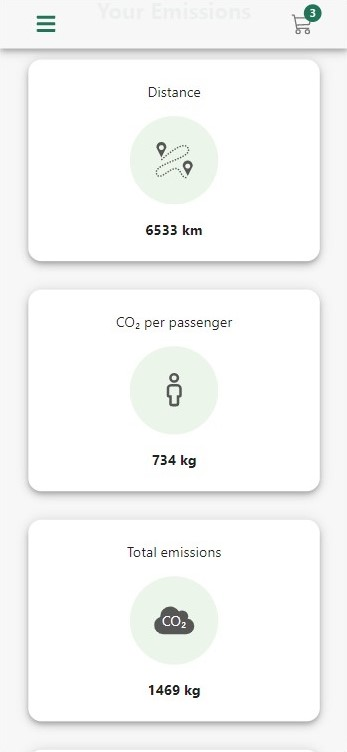
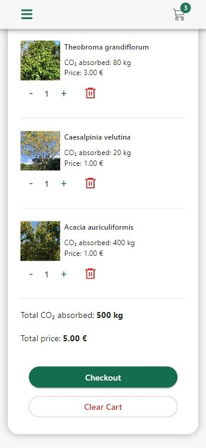

<a name="readme-top"></a>

[![Contributors][contributors-shield]][contributors-url]
[![Forks][forks-shield]][forks-url]
[![Stargazers][stars-shield]][stars-url]
[![Issues][issues-shield]][issues-url]
[![MIT License][license-shield]][license-url]
[![LinkedIn][linkedin-shield]][linkedin-url]

<!-- PROJECT LOGO -->
<br />
<div align="center">
  <a href="https://github.com/alisherkhan98/frontend-final-project">
    
  </a>

<h3 align="center">Impact</h3>

  <p align="center">
    Calculate your footprint
    <br />
    <br />
    <a href="https://github.com/alisherkhan98/frontend-final-project"><strong>Explore the docs »</strong></a>
    <br />
    <br />
    <a href="https://impactreactapp.netlify.app/">View Demo</a>
    ·
    <a href="https://github.com/alisherkhan98/frontend-final-project/issues">Report Bug</a>
    ·
    <a href="https://github.com/alisherkhan98/frontend-final-project/issues">Request Feature</a>
  </p>
</div>
<br />
<br />
<!-- TABLE OF CONTENTS -->
<details>
  <summary>Table of Contents</summary>
  <ol>
    <li>
      <a href="#about-the-project">About The Project</a>
      <ul>
        <li><a href="#built-with">Built With</a></li>
      </ul>
    </li>
    <li>
      <a href="#getting-started">Getting Started</a>
      <ul>
        <li><a href="#prerequisites">Prerequisites</a></li>
        <li><a href="#installation">Installation</a></li>
      </ul>
    </li>
    <li><a href="#usage">Usage</a></li>
    <li><a href="#contributing">Contributing</a></li>
    <li><a href="#contact">Contact</a></li>
  </ol>
</details>
<br />
<!-- ABOUT THE PROJECT -->

## About The Project

<div style="display:flex">



</div>

<p align="right">(<a href="#readme-top">back to top</a>)</p>

## Built With

- [![ReactRouter][reactrouter-shield]][reactrouter-url]
- [![Axios][axios-shield]][axios-url]
- [![Firebase][firebase-shield]][firebase-url]
- [![ReactJs][react-shield]][react-url]
- [![Material UI][mui-shield]][mui-url]
- [![Redux][redux-shield]][redux-url]
- [![Stripe][stripe-shield]][stripe-url]

<p align="right">(<a href="#readme-top">back to top</a>)</p>

<!-- GETTING STARTED -->

## Getting Started

To get a local copy of the project up and running follow these simple example steps.

### Prerequisites

- Install [Node.js](https://nodejs.org/it/download)
- run
  ```sh
  npm install npm@latest -g
  ```

### Installation

1. Clone the repo
   ```sh
   git clone https://github.com/alisherkhan98/frontend-final-project.git
   ```
2. Install NPM packages
   ```sh
   npm install
   ```
3. Now if you want to open a live server to start developing type this in your terminal:

   ```sh
   npm start
   ```

   otherwise if you want to build the final files bundeled with webpack type

   ```sh
   npmm run build
   ```

   This will create a new dist folder with the built files in it

### Environment variables

To calculate the emissions I used [Carbon Interface](https://www.carboninterface.com/). In order to use the API you need an API key which you can get once you sign up. Then save your API key as an environment variable (in a .env file) like in the .env.example file.

You will also need to configure a firebase app and set its variables as environment variables

<p align="right">(<a href="#readme-top">back to top</a>)</p>

<!-- USAGE EXAMPLES -->

## Usage

There are two main features in the app: the emissions calculator and the shop.

In the home screen you can fill out a form with the departure and arrival airport and the number of passengers to calculate the carbon footprint.

In the shop screen you can add the items to your cart (once you have signed in), and then checkout in the cart screen that will redirect you to the ready made stripe payment screen. The process is only a simulation and will not actually charghe any money.

Use the following cards for tests:

- Success: `4242424242424242`
- Denied: `4000000000009995`
- Requires authentication: `4000002500003155`

then fill out the rest with any fictional data

<p align="right">(<a href="#readme-top">back to top</a>)</p>

## Error handling

If an error occurs with any of the authentication functions the promise chain is aborted and an alert appears to explain what happened and the page is automatically scrolled to the alert.

<!-- CONTRIBUTING -->

## Contributing

Contributions are what make the open source community such an amazing place to learn, inspire, and create. Any contributions you make are **greatly appreciated**.

If you have a suggestion that would make this better, please fork the repo and create a pull request. You can also simply open an issue with the tag "enhancement".
Don't forget to give the project a star! Thanks again!

1. Fork the Project
2. Create your Feature Branch (`git checkout -b feature/AmazingFeature`)
3. Commit your Changes (`git commit -m 'Add some AmazingFeature'`)
4. Push to the Branch (`git push origin feature/AmazingFeature`)
5. Open a Pull Request

<p align="right">(<a href="#readme-top">back to top</a>)</p>

<!-- CONTACT -->

## Contacts

Email: asherkhan982@gmail.com

My [LinkedIn](https://linkedin.com/in/ali-sher-khan-1331a8205)

Project Link: [https://github.com/alisherkhan98/frontend-final-project](https://github.com/alisherkhan98/frontend-final-project)

<p align="right">(<a href="#readme-top">back to top</a>)</p>

<!-- MARKDOWN LINKS & IMAGES -->
<!-- https://www.markdownguide.org/basic-syntax/#reference-style-links -->

[contributors-shield]: https://img.shields.io/github/contributors/alisherkhan98/frontend-final-project.svg?style=for-the-badge
[contributors-url]: https://github.com/alisherkhan98/frontend-final-project/graphs/contributors
[forks-shield]: https://img.shields.io/github/forks/alisherkhan98/frontend-final-project.svg?style=for-the-badge
[forks-url]: https://github.com/alisherkhan98/frontend-final-project/network/members
[stars-shield]: https://img.shields.io/github/stars/alisherkhan98/frontend-final-project.svg?style=for-the-badge
[stars-url]: https://github.com/alisherkhan98/frontend-final-project/stargazers
[issues-shield]: https://img.shields.io/github/issues/alisherkhan98/frontend-final-project.svg?style=for-the-badge
[issues-url]: https://github.com/alisherkhan98/frontend-final-project/issues
[license-shield]: https://img.shields.io/github/license/alisherkhan98/frontend-final-project.svg?style=for-the-badge
[license-url]: https://github.com/alisherkhan98/frontend-final-project/blob/master/LICENSE.txt
[linkedin-shield]: https://img.shields.io/badge/-LinkedIn-black.svg?style=for-the-badge&logo=linkedin&colorB=555
[linkedin-url]: https://linkedin.com/in/ali-sher-khan-1331a8205
[product-screenshot1]: src/assets/images/screenshot1.jpeg
[product-screenshot2]: src/assets/images/screenshot2.jpeg
[product-screenshot3]: src/assets/images/screenshot3.jpeg
[reactrouter-shield]: https://img.shields.io/badge/-React%20Router-CA4245?style=for-the-badge&logo=reactrouter&logoColor=white
[reactrouter-url]: https://reactrouter.com/en/main
[react-shield]: https://img.shields.io/badge/-React-61DAFB?style=for-the-badge&logo=react&logoColor=black
[react-url]: https://reactjs.org/
[redux-shield]: https://img.shields.io/badge/-Redux-764ABC?style=for-the-badge&logo=redux&logoColor=white
[redux-url]: https://redux.js.org/
[firebase-shield]: https://img.shields.io/badge/-Firebase-FFCA28?style=for-the-badge&logo=firebase&logoColor=black
[firebase-url]: https://firebase.google.com/
[mui-shield]: https://img.shields.io/badge/-Material%20ui-007FFF?style=for-the-badge&logo=mui&logoColor=white
[mui-url]: https://mui.com/
[stripe-shield]: https://img.shields.io/badge/-Stripe-635bff?style=for-the-badge&logo=stripe&logoColor=white
[stripe-url]: https://stripe.com/
[axios-shield]: https://img.shields.io/badge/-axios-7e3e8d?style=for-the-badge&logo=axios&logoColor=white
[axios-url]: https://axios-http.com
